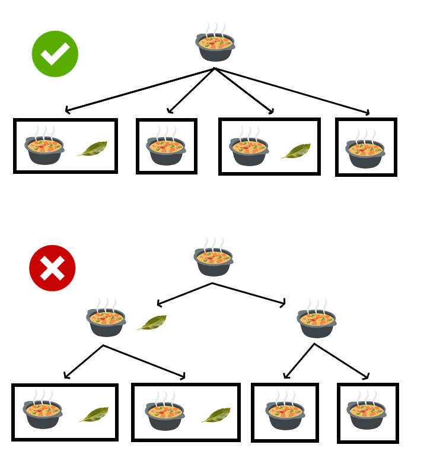
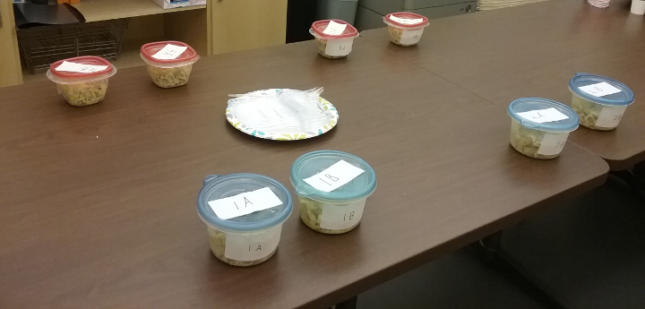
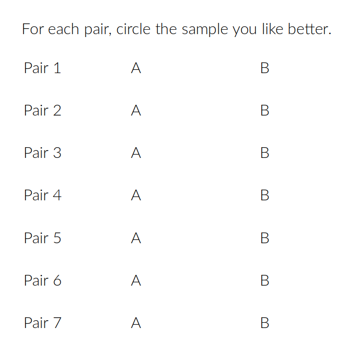

```{r setup, echo = F, message = F, warning = F}
library(knitr)
library(kableExtra)
library(tibble)
library(tidyr)
library(dplyr)
library(arm)
library(rstan)
library(ggplot2)
theme_set(theme_bw())
```

> The GitHub repo for all this can be found [here](https://github.com/kaplanas/Bay-Leaf-Experiment).

# {.tabset .tabset-pills}

## Research question


> When you include a bay leaf in a recipe, does it actually make the food taste better?

### Things that are *not* my research question

* Does a bay leaf have a detectable flavor if you just chew on it?
* If you boil bay leaves in plain water, can you taste the difference?
* Can a professional chef taste the difference that high-quality bay leaves make in an expertly-prepared dish?

### A more specific version of my research question

When an average person uses average bay leaves in an average recipe, will that person notice a difference in how the food tastes?

### Prior research

Kelly Conaboy at [The Awl](https://www.theawl.com/2016/03/the-vast-bay-leaf-conspiracy/) asked several chefs about bay leaves, and almost all said they're beneficial.  Several said that only fresh bay leaves work.

[Bon Appetit](https://www.bonappetit.com/story/bay-leaves-taste) says that if you boil bay leaves in water and then drink the water, you can taste the bay leaves.

J. Kenji López-Alt at [Serious Eats](https://www.seriouseats.com/2014/03/ask-the-food-lab-whats-the-point-of-bay-leaves.html) also recommends the boil-them-in-water-and-taste-the-difference method.  He argues for using dried bay leaves because fresh bay leaves are too strong.

Claire Lower tested bay leaves for [Lifehacker](https://skillet.lifehacker.com/do-bay-leaves-even-do-anything-1793275685): she cooked three batches of rice with bay leaves (one with fresh leaves, one with newly bought dry leaves, and one with old dry leaves) and three without.  She could taste a difference between the batches with bay leaves and the batches without.  The test was not blind.

Zach and Clay at [The Bitten Word](https://www.thebittenword.com/thebittenword/2013/02/bay-leaves-worthless-recipe-pressure-cooker-chicken-stock.html) did a blind taste-test of two batches of chicken stock.  They preferred the batch that had bay leaf, but they thought the difference was very subtle.

Lots of people argued that bay leaf is easier to taste in a milder dish.  Several singled out beef stew as an example of a dish where the bay leaf would be hard to notice.

## The experiment

Some very kind friends and family agreed to humor me by taste-testing food that had been prepared with and without bay leaves.  I've performed the experiment on a couple of separate occasions; let's call each occasion a "batch".  A batch proceeds as follows:

### Step 1: Prepare as many separate portions of the dish as possible

The more separate portions we have, the more data we can get.  It's not enough to have just two portions of the dish (one with bay leaf and one without); even if people prefer the one with bay leaf, we can't be sure that it was *because* of the bay leaf.  There's always another possibile explanation:

* If I cooked the two portions completely separately, maybe the carrot that I used for the one with bay leaf was slightly more delicious than the carrot I used for the one without (because it grew in better soil, or it was a few hours fresher, or whatever).
* If I cooked the two portions together for a while and then separated them so I could add the bay leaf to half, maybe I happened to scoop a few more grams of onion into the half that got the bay leaf.
* If it's a dish that's uniform (i.e., no "chunks" -- think chicken stock instead of stew), maybe I served them in bowls that added slightly different tastes (because they were washed with different soap, or in different parts of the dishwasher, or something).

Any given pair might have any of the problems listed above.  But if we make many pairs, it's extremely unlikely that *every* portion with bay leaf also happens to have some other advantage over its partner.  If people consistently prefer the portion with bay leaf across many pairs, we can be pretty confident that the bay leaf really is responsible.

To make sure the portions were truly independent, they were cooked completely separately (different pots, utensils, everything) from the point where bay leaf was added and onward.



### Step 2: Put the portions into pairs: one portion with bay leaf, one without



### Step 3: Have people test each pair blindly and choose the portion they prefer

I labelled the bowls in each pair and gave each person a sheet of paper for recording their preferences.

```{r sample_data_sheet, echo = F, out.width = "50%", out.extra = 'style="border: 3px solid black"'}

```

I didn't get IRB approval for any of this.  I believe this experiment falls under the "taste and food quality evaluation" exemption for human subjects research.

## Raw data

```{r load_data, echo = F, message = F, warning = F}
# Load the raw data from csv files.  The first file has observation-level data;
# the second has batch-level data.
obs.df = read.csv("bay_leaf_observations.csv")
batch.df = read.csv("bay_leaf_batches.csv")
# Add IDs to the rows in the observation-level data; useful for associating a
# single observation with multiple posterior predictions later.
obs.df = obs.df %>%
  rownames_to_column("obs.id")
# Prepare the data for Stan: convert IDs and outcomes to integers.  (They
# should already be integers, but just in case.)
obs.df = obs.df %>%
  mutate(int.batch.id = as.numeric(as.factor(batch.id)),
         int.subject.id = as.numeric(as.factor(subject.id)),
         int.pair.id = as.numeric(as.factor(pair.id)),
         int.prefer.bay.leaf = ifelse(prefer.bay.leaf , 1, 0))
```

In addition to my data, I'm including Zach and Clay's experiment at [The Bitten Word](https://www.thebittenword.com/thebittenword/2013/02/bay-leaves-worthless-recipe-pressure-cooker-chicken-stock.html), because their procedure was the same as mine in the most important respects: a pair of portions that were as similar as possible, and a blind head-to-head comparison.  I'm crediting them with two observations (one for each person), although it sounds like Zach and Clay discussed their impressions with each other before deciding on the portion they preferred, which would mean their observations weren't actually independent.  I'm willing to live with this.

All together, we now have a total of `r nrow(batch.df)` batches:

```{r list_batches, echo = F, message = F, warning = F}
obs.df %>%
  group_by(batch.id) %>%
  summarize(num.subjects = n_distinct(subject.id),
            num.pairs = n_distinct(pair.id),
            num.observations = sum(ifelse(is.na(prefer.bay.leaf), 0, 1))) %>%
  inner_join(batch.df, by = c("batch.id")) %>%
  dplyr::select(batch.id, batch.recipe, num.subjects, num.pairs,
                num.observations) %>%
  kable(col.names = c("Batch ID", "Recipe", "# subjects", "# pairs", "# observations")) %>%
  kable_styling(full_width = T)
```

To get a preliminary sense of the data, let's look at some raw numbers.  How often did people prefer the portion with bay leaf?

```{r plot_raw_data, echo = F, message = F, warning = F, fig.width = 4, fig.height = 4}
ggplot(obs.df, aes(x = prefer.bay.leaf)) +
  geom_bar() +
  scale_x_discrete("preferred bay leaf") +
  scale_y_continuous("number of observations")
```

Note that there were `r sum(ifelse(is.na(obs.df$prefer.bay.leaf), 1, 0))` cases where the subject didn't make a choice.  Out of the other `r format(nrow(obs.df %>% filter(!is.na(prefer.bay.leaf))), big.mark = ",")` observations, people preferred the portion with bay leaf in `r format(sum(obs.df$prefer.bay.leaf, na.rm = T), big.mark = ",")` cases: `r round(sum(obs.df$prefer.bay.leaf, na.rm = T) / nrow(obs.df %>% filter(!is.na(prefer.bay.leaf))), 2) * 100`% of the time.  That's a trend in the right direction, although it's not overwhelming.

But is this slight preference for bay leaf reliable, or could it be a fluke?  What happens when we do a careful statistical analysis?

## Analysis in Stan {.tabset}

Skip this section if you're not interested in the technical details of the statistical model.

If you're not familiar with Bayesian modeling in Stan, think of it this way: we specify the parameters of the model (e.g., a parameter for "overall probability of preferring the portion with bay leaf"); Stan tries out a bunch of different possible values for the parameter and tests them against our data.  What we get from Stan, for each parameter, is a distribution of samples over possible values; there are more samples for the values that are more consistent with our data, and fewer samples for the values that are less consistent with our data. We can interpret these sampling distributions as estimates of how likely it is that a given parameter has a given value.

### Model(s)

#### Outcome and parameters

The outcome variable, $\mbox{prefer.bay.leaf}$, is binary.  Let's do a logistic regression.  In addition to the overall intercept, we'll have adjustments to the intercept by batch, subject, and pair.

$$\mbox{prefer.bay.leaf} = \mbox{Bernoulli}(\mbox{logit}^{-1}(\beta + \gamma_i\sigma_{\gamma_i} + \delta_j\sigma_{\delta_j} + \epsilon_k\sigma_{\epsilon_k}))$$

* $\beta$ is the intercept: the overall preference for portions with bay leaf.  This is the parameter we're most interested in.
* $\gamma_i$ is the adjustment to the intercept for batch $i$.
* $\delta_j$ is the adjustment to the intercept for subject $j$, nested within batch $i$.
* $\epsilon_k$ is the adjustment to the intercept for pair $k$, nested within batch $i$.

(In real life, subjects weren't actually nested within batches; some subjects -- including me -- participated in multiple batches.  But, to preserve subjects' privacy, I haven't tracked subject identity across batches.)

I'm going to try a series of models, each of which adds one more set of parameters, to evaluate whether all these parameters are actually helpful:

| Model | Overall ($\beta$) | Batch ($\gamma$) | Subject ($\delta$) | Pair ($\epsilon$) |
| ----- | ----------------- | ---------------- | ------------------ | ----------------- |
| 1     | Y                 |                  |                    |                   |
| 2     | Y                 | Y                |                    |                   |
| 3     | Y                 | Y                | Y                  |                   |
| 4     | Y                 | Y                | Y                  | Y                 |

#### Priors

Let's put a weak prior of $\mbox{N}(0, 2)$ on $\beta$.  Since prior is centered at zero, it will make our model somewhat conservative.

$$\beta \sim \mbox{N}(0, 2)$$

I'm including a parameter for the standard deviation of each of the group-level intercepts, and giving each of these $\sigma$ parameters a half-Cauchy prior.

Priors for batches:

$$\sigma_\gamma \in [0, \inf] \sim \mbox{Cauchy}(0, 1)$$

$$\gamma_i \sim \mbox{N}(0, 1)$$

Priors for pairs:

$$\sigma_\delta \in [0, \inf] \sim \mbox{Cauchy}(0, 1)$$

$$\delta_j \sim \mbox{N}(0, 1)$$

Priors for subjects:

$$\sigma_\epsilon \in [0, \inf] \sim \mbox{Cauchy}(0, 1)$$

$$\epsilon_k \sim \mbox{N}(0, 1)$$

### Stan code

```{r stan_model, echo = F, comment = NA}
writeLines(readLines("bay_leaf_analysis.stan"))
```

### Simulated data

To test the specification of the model, let's simulate some data and test whether we can recover the true parameters.

#### Simulated inputs

For a large dataset, I would create a much smaller simulated dataset with inputs that have approximately the same distribution as the inputs in the full dataset -- to save time.  But we're working with much smaller amounts of data here, so I'll just copy the actual inputs.  Simulating the actual size of the real dataset also has the advantage that it gives us some sense of how precisely we'll be able to estimate our parameters.

```{r simulate_inputs, eval = F}
# Set up a dataframe for simulated data.
sim.df = obs.df %>%
  filter(!is.na(obs.df$prefer.bay.leaf)) %>%
  dplyr::select(obs.id, int.batch.id, int.subject.id, int.pair.id)
# List the simulations we're going to run, and their properties.
simulations = data.frame(
  sim = 1:4,
  generate.batch = c(F, T, T, T),
  fit.batch = c(F, T, T, T),
  generate.subject = c(F, F, T, T),
  fit.subject = c(F, F, T, T),
  generate.pair = c(F, F, F, T),
  fit.pair = c(F, F, F, T)
)
```

#### Simulated parameters

```{r simulate_parameters, eval = F}
# Simulate parameters by drawing from their priors.  For simulation purposes,
# beta and the sigmas are drawn from a much narrower distribution than their
# priors in the model.
true.params.sim.df = data.frame(
  draw.id = 1,
  beta = rnorm(1, 0, 0.5),
  sigma_gamma = abs(rcauchy(1, 0, 0.3)),
  sigma_delta = abs(rcauchy(1, 0, 0.3)),
  sigma_epsilon = abs(rcauchy(1, 0, 0.3))
)
true.params.sim.df[,paste("gamma.", sort(unique(obs.df$int.batch.id)), ".", sep = "")] =
  rnorm(length(unique(obs.df$int.batch.id)), 0, 1)
true.params.sim.df[,paste("delta.", sort(unique(obs.df$int.subject.id)), ".", sep = "")] =
  rnorm(length(unique(obs.df$int.subject.id)), 0, 1)
true.params.sim.df[,paste("epsilon.", sort(unique(obs.df$int.pair.id)), ".", sep = "")] =
  rnorm(length(unique(obs.df$int.pair.id)), 0, 1)
true.params.sim.long.df = true.params.sim.df %>%
  gather(parameter, true.value)
```

#### Simulated outcomes

For each model, the simulated data includes only those effects that are actually modeled.  (I.e., for models that don't include subject-level effects, the simulation process doesn't have any subject-level effects.)

```{r simulate_outcomes, eval = F}
# A utility function that simulates outcomes for a given model and a given set
# of parameter draws; we'll use this both to generate outcomes for the
# simulated datasets and to do posterior predictive checking.
generate.outcomes = function(inputs.df, parameters.df, n.draws, generate.batch,
                             generate.subject, generate.pair) {
  # Set up the dataframe to hold both inputs and generated outcomes.
  outputs.df = inputs.df
  # Create model matrices for batch, subject, and pair (if needed).
  if(generate.batch) {
    mm.batch = model.matrix(~ factor(int.batch.id), outputs.df,
                            contrasts.arg =
                              list("factor(int.batch.id)" =
                                     contrasts(factor(outputs.df$int.batch.id),
                                               contrasts = F)))[,-1]
  }
  if(generate.subject) {
    mm.subject = model.matrix(~ factor(int.subject.id), outputs.df,
                              contrasts.arg =
                                list("factor(int.subject.id)" =
                                     contrasts(factor(outputs.df$int.subject.id),
                                               contrasts = F)))[,-1]
  }
  if(generate.pair) {
    mm.pair = model.matrix(~ factor(int.pair.id), outputs.df,
                           contrasts.arg =
                             list("factor(int.pair.id)" =
                                    contrasts(factor(outputs.df$int.pair.id),
                                              contrasts = F)))[,-1]
  }
  # Randomly draw from the parameters the specified number of times.
  draws.df = sample_n(parameters.df, n.draws, replace = T)
  # Create the matrix of data and the matrix of parameters.
  data.matrix = cbind(rep(1, nrow(outputs.df)))
  param.matrix = cbind(draws.df$beta)
  if(generate.batch) {
    data.matrix = cbind(data.matrix,
                        mm.batch)
    param.matrix = cbind(param.matrix,
                         draws.df[,paste("gamma.",
                                         sort(unique(outputs.df$int.batch.id)),
                                         ".", sep = "")] * draws.df$sigma_gamma)
  }
  if(generate.subject) {
    data.matrix = cbind(data.matrix,
                        mm.subject)
    param.matrix = cbind(param.matrix,
                         draws.df[,paste("delta.",
                                         sort(unique(outputs.df$int.subject.id)),
                                         ".", sep = "")] * draws.df$sigma_delta)
  }
  if(generate.pair) {
    data.matrix = cbind(data.matrix,
                        mm.pair)
    param.matrix = cbind(param.matrix,
                         draws.df[,paste("epsilon.",
                                         sort(unique(outputs.df$int.pair.id)),
                                         ".", sep = "")] * draws.df$sigma_epsilon)
  }
  # Generate the probability of preferring bay leaf for each observation and
  # for each draw.
  prefer.bay.leaf.prob.pred = invlogit(data.matrix %*% t(param.matrix))
  # Convert each probability to a prediction (i.e., sample from the
  # probability) and add the predictions to the data frame.
  prefer.bay.leaf.preds = matrix(ifelse(prefer.bay.leaf.prob.pred >
                                          runif(length(prefer.bay.leaf.prob.pred),
                                                       0, 1), 1, 0),
                                 ncol = ncol(prefer.bay.leaf.prob.pred))
  outputs.df = cbind(outputs.df,
                     prefer.bay.leaf.preds)
  # Convert the dataframe from wide to long.
  outputs.df = outputs.df %>%
    gather(draw.id, prefer.bay.leaf.pred, -obs.id, -int.batch.id,
           -int.subject.id, -int.pair.id) %>%
    dplyr::select(obs.id, int.batch.id, int.subject.id, int.pair.id,
                  prefer.bay.leaf.pred)
  return(outputs.df)
}
# Use the function to generate simulated outcomes for each of the models.
for(i in 1:nrow(simulations)) {
  temp = generate.outcomes(sim.df %>%
                             dplyr::select(obs.id, int.batch.id,
                                           int.subject.id, int.pair.id),
                           true.params.sim.df, 1,
                           simulations$generate.batch[i],
                           simulations$generate.subject[i],
                           simulations$generate.pair[i])
  sim.df[,paste("prefer.bay.leaf", i, sep = ".")] = temp$prefer.bay.leaf.pred == 1
  sim.df[,paste("int.prefer.bay.leaf", i, sep = ".")] = temp$prefer.bay.leaf.pred
}
rm(i, temp)
```

#### Fit the simulated data

```{r fit_sim_data, eval = F, message = F, warning = F}
# Create the datasets for Stan.
sim.data.for.stan = list()
for(i in 1:nrow(simulations)) {
  temp = list(N = nrow(sim.df),
              prefer_bay_leaf = sim.df[,paste("int.prefer.bay.leaf", i, sep = ".")])
  if(simulations$fit.batch[i]) {
    temp[["I"]] = max(sim.df$int.batch.id)
    temp[["batch"]] = sim.df$int.batch.id
  } else {
    temp[["I"]] = 0
    temp[["batch"]] = rep(1, nrow(sim.df))
  }
  if(simulations$fit.subject[i]) {
    temp[["J"]] = max(sim.df$int.subject.id)
    temp[["subject"]] = sim.df$int.subject.id
  } else {
    temp[["J"]] = 0
    temp[["subject"]] = rep(1, nrow(sim.df))
  }
  if(simulations$fit.pair[i]) {
    temp[["K"]] = max(sim.df$int.pair.id)
    temp[["pair"]] = sim.df$int.pair.id
  } else {
    temp[["K"]] = 0
    temp[["pair"]] = rep(1, nrow(sim.df))
  }
  sim.data.for.stan[[i]] = temp
}
rm(i, temp)
# Fit each model.
fit.sim.stan = list()
for(i in 1:nrow(simulations)) {
  temp = stan("bay_leaf_analysis.stan",
              data = sim.data.for.stan[[i]],
              chains = 4, iter = 2000,
              control = list(adapt_delta = 0.99))
  fit.sim.stan[[i]] = temp
}
rm(i, temp)
```

#### Check the fit of the simulated data

```{r extract_sim_results, message = F, warning = F}
# Extract divergent transitions and treedepth.
sampler.diagnostics.sim.df = bind_rows(
  lapply(
    fit.sim.stan,
    function(x) {
      bind_rows(
        lapply(
          get_sampler_params(x, inc_warmup = F),
          function(y) {
            data.frame(y)
          }
        ),
        .id ="chain"
      )
    }
  ),
  .id = "model"
)
# Extract n_eff and Rhat for each parameter.
summary.params.sim.df = bind_rows(
  lapply(
    fit.sim.stan,
    function(x) {
      data.frame(t(summary(x)$summary[,c("n_eff", "Rhat")])) %>%
        setNames(gsub("[[]|[]]", "\\.", colnames(.))) %>%
        rownames_to_column("summary.statistic") %>%
        gather(parameter, value, -summary.statistic) %>%
        spread(summary.statistic, value)
    }
  ),
  .id = "model"
)
# Extract the sampled parameter values.
sampled.params.sim.df = bind_rows(
  lapply(
    fit.sim.stan,
    function(x) {
      temp.array = as.array(x)
      temp.df = bind_rows(
        lapply(
          1:nrow(simulations),
          function(x) {
            data.frame(temp.array[,x,]) %>%
              setNames(gsub("[[]|[]]", "\\.", colnames(.))) %>%
              setNames(gsub("^(sigma_[a-z]+)\\.1\\.$", "\\1", colnames(.))) %>%
              rownames_to_column("iteration")
            }),
        .id = "chain")
      return(temp.df)
    }
  ),
  .id = "simulation"
)
sampled.params.sim.long.df = sampled.params.sim.df %>%
  gather(parameter, sampled.value, -simulation, -chain, -iteration) %>%
  filter(parameter != "lp__" & !is.na(sampled.value)) %>%
  mutate(parameter.group = gsub("^(gamma|delta|epsilon).*", "\\1", parameter))
```

There were `r sum(sampler.diagnostics.sim.df$divergent__)` divergent transitions across all `r nrow(simulations)` models.  The chains are stationary and well mixed.  No parameter in any model had an Rhat greater than `r round(max(summary.params.sim.df$Rhat[summary.params.sim.df$parameter != "lp__"]), 4)` or an n_eff less than `r floor(min(summary.params.sim.df$n_eff[summary.params.sim.df$parameter != "lp__"]))`.

```{r plot_sim_chains, message = F, warning = F, fig.width = 12, fig.height = 9}
# Plot the chains.
sampled.params.sim.long.df %>%
  filter(grepl("beta|sigma", parameter)) %>%
  ggplot(aes(x = iteration, y = sampled.value, col = chain)) +
  geom_line(aes(group = chain)) +
  facet_grid(parameter ~ simulation, scales = "free") +
  scale_y_continuous("sampled value") +
  theme(axis.ticks.x = element_blank(),
        axis.text.x = element_blank())
```

#### Did the model capture the true parameter values?

The model has done a decent job of capturing the true values of $\beta$, $\sigma_\gamma$, $\sigma_\delta$, and $\sigma_\epsilon$ (plotted in red).  When we add batch-level effects, the model consistently underestimates $\beta$ by a small amount; this is because, out of the `r max(sim.df$int.batch.id)` $\gamma_i$s, `r sum(true.params.sim.long.df[grepl("^gamma", true.params.sim.long.df$parameter),]$true.value < 0)` happened to be simulated with negative values.  Stan assigns some of that dispreference for bay leaf to $\beta$ instead of to all the individual $\gamma_i$s.

```{r plot_sampled_sim_parameters_beta_sigma, message = F, warning = F, fig.width = 8, fig.height = 6}
sampled.params.sim.long.df %>%
  filter(grepl("beta|sigma", parameter)) %>%
  mutate(parameter = factor(parameter,
                            levels = c("beta", "sigma_gamma", "sigma_delta",
                                       "sigma_epsilon"))) %>%
  ggplot(aes(x = sampled.value)) +
  # geom_density(fill = "lightgray", size = 0.3) +
  geom_histogram() +
  geom_vline(data = true.params.sim.long.df %>%
               filter(grepl("beta|sigma", parameter)) %>%
               mutate(parameter = factor(parameter,
                                         levels = c("beta", "sigma_gamma",
                                                    "sigma_delta", "sigma_epsilon"))),
             aes(xintercept = true.value),
             col = "red") +
  facet_grid(simulation ~ parameter, scale = "free") +
  scale_x_continuous("sampled values") +
  scale_y_continuous("")
```

<a name="simfit"></a>The model does less well in recovering the group-level intercepts $\gamma_i$, $\delta_j$, and $\epsilon_k$.  This isn't shocking, since we have so few observations for each group.  Everything is shrunk towards zero.  At any rate, the recovered parameter values are so unreliable that I'm reluctant to try to do much in the way of inference on the real data at all.  At best, if the samples for a given parameter are reliably on one side of zero, we might be able to conclude that there's a real effect of bay leaf in that group.  But *lack* of an effect should be interpreted with extreme caution, because of the wide credible intervals and the shrinkage toward zero.

```{r plot_sampled_sim_group_parameters, message = F, warning = F, fig.width = 8, fig.height = 5}
sampled.params.sim.long.df %>%
  filter(grepl("^(gamma|delta|epsilon)", parameter)) %>%
  mutate(parameter.group = factor(parameter.group,
                                  levels = c("gamma", "delta", "epsilon"))) %>%
  group_by(simulation, parameter.group, parameter) %>%
  summarize(mean.sampled.value = mean(sampled.value),
            upper.bound = quantile(sampled.value, 0.975),
            lower.bound = quantile(sampled.value, 0.025)) %>%
  inner_join(true.params.sim.long.df, by = c("parameter")) %>%
  ggplot(aes(x = true.value, y = mean.sampled.value)) +
  geom_point() +
  geom_errorbar(aes(ymin = lower.bound, ymax = upper.bound)) +
  geom_abline(intercept = 0, slope = 1, col = "gray") +
  facet_grid(simulation ~ parameter.group) +
  scale_x_continuous("true value") +
  scale_y_continuous("sampled values")
```

#### Posterior predictive checks

The predictions are...not great.  For such a small dataset, though, I suppose they could be worse.  Part of the problem is that we just can't make strong predictions about most of the data points.

```{r posterior_predictive_checks_sim, eval = F, message = F, warning = F}
# Generate predicted outputs for the simulated data based on the fitted model.
for(i in 1:nrow(simulations)) {
  temp = generate.outcomes(sim.df,
                           sampled.params.sim.df %>%
                             filter(simulation == i),
                           1000,
                           simulations$fit.subject[i],
                           simulations$fit.batch[i],
                           simulations$fit.pair[i]) %>%
    group_by(obs.id) %>%
    summarize(mean.pred = mean(prefer.bay.leaf.pred, na.rm = T))
  sim.df[,paste("mean.pred", i, sep = ".")] = data.frame(temp)$mean.pred
}
rm(i, temp)
```

```{r plot_posterior_predictive_checks_sim, message = F, warning = F, fig.width = 6, fig.height = 10}
ggplot(sim.df %>%
         dplyr::select(-matches("int\\..*\\.id")) %>%
         dplyr::select(-matches("^prefer")) %>%
         gather(measure, value, -obs.id) %>%
         mutate(simulation = gsub("^.*([0-9]+).*$", "\\1", measure)) %>%
         mutate(measure = gsub("\\.[0-9]", "", measure)) %>%
         spread(measure, value),
       aes(x = mean.pred, y = int.prefer.bay.leaf)) +
  geom_jitter(height = 0.1, width = 0) +
  geom_abline(intercept = 0, slope = 1, col = "gray") +
  stat_smooth() +
  facet_wrap(~ simulation, ncol = 1, scales = "free_y") +
  scale_x_continuous("mean predicted preference for bay leaf") +
  scale_y_continuous("actual choice")
```

### Real data

We'll fit the real dataset with batch- and subject-level effects only, not pair-level effects.  Even the estimated subject-level effects should be treated with extreme caution.

```{r fit_real_data, eval = F, message = F, warning = F}
# Create the dataset for Stan.
data.for.stan = list(N = nrow(obs.df[!is.na(obs.df$prefer.bay.leaf),]),
                     I = max(obs.df[!is.na(obs.df$prefer.bay.leaf),]$int.batch.id),
                     J = max(obs.df[!is.na(obs.df$prefer.bay.leaf),]$int.subject.id),
                     K = 0,
                     batch = obs.df[!is.na(obs.df$prefer.bay.leaf),]$int.batch.id,
                     subject = obs.df[!is.na(obs.df$prefer.bay.leaf),]$int.subject.id,
                     pair = rep(1, nrow(obs.df[!is.na(obs.df$prefer.bay.leaf),])),
                     prefer_bay_leaf = obs.df[!is.na(obs.df$prefer.bay.leaf),]$int.prefer.bay.leaf)
# Fit the model.
fit.stan = stan("bay_leaf_analysis.stan",
                data = data.for.stan,
                chains = 4, iter = 2000,
                control = list(adapt_delta = 0.99))
```

#### Check the fit of the model

```{r extract_real_results, echo = F, message = F, warning = F}
# Extract divergent transitions and treedepth.
sampler.diagnostics.df = bind_rows(
  lapply(
    get_sampler_params(fit.stan, inc_warmup = F),
    function(x) {
      data.frame(x)
    }
  ),
  .id ="chain"
)
# Extract n_eff and Rhat for each parameter.
summary.params.df = data.frame(t(summary(fit.stan)$summary[,c("n_eff", "Rhat")])) %>%
  setNames(gsub("[[]|[]]", "\\.", colnames(.))) %>%
  rownames_to_column("summary.statistic") %>%
  gather(parameter, value, -summary.statistic) %>%
  spread(summary.statistic, value)
# Extract the sampled parameter values from the model fit.
sampled.params.df = as.data.frame(fit.stan) %>%
  setNames(gsub("[[]|[]]", "\\.", colnames(.))) %>%
  setNames(gsub("^(sigma_[a-z]+)\\.1\\.$", "\\1", colnames(.))) %>%
  rownames_to_column("draw.id")
sampled.params.long.df = sampled.params.df %>%
  gather(parameter, sampled.value, -draw.id) %>%
  mutate(parameter.group =  gsub("^.*(beta|gamma|delta|epsilon).*$", "\\1", parameter),
         parameter.num = as.numeric(gsub("^.*\\.([0-9]+)\\..*$", "\\1", parameter)))
```

There were `r sum(sampler.diagnostics.df$divergent__)` divergent transitions.  The chains are stationary and well mixed.  No parameter had an Rhat greater than `r round(max(summary.params.df$Rhat[summary.params.df$parameter != "lp__"]), 4)` or an n_eff less than `r floor(min(summary.params.df$n_eff[summary.params.df$parameter != "lp__"]))`.

```{r plot_chains, echo = F, message = F, warning = F, fig.width = 12, fig.height = 8}
stan_trace(fit.stan)
```

#### Posterior predictive checks

```{r posterior_predictive_checks, message = F, warning = F}
# Generate predicted outputs for the real data based on the fitted model.
pred.df = generate.outcomes(obs.df[!is.na(obs.df$prefer.bay.leaf),],
                            sampled.params.df,
                            1000, T, T, F) %>%
  group_by(obs.id) %>%
  summarize(mean.pred = mean(prefer.bay.leaf.pred)) %>%
  inner_join(obs.df, by = c("obs.id"))
```

The posterior predictions actually look pretty good.  But across the entire dataset, the predicted probability of preferring bay leaf falls within a really narrow range -- from `r round(min(pred.df$mean.pred) * 100)`% to `r round(max(pred.df$mean.pred) * 100)`%.  Could it be that we're just seeing a model that, much of the time, correctly predicts "meh"?  (Even within this narrow range, the model's predictions are more conservative than required by the actual data: at the high end, subjects are even more likely to prefer bay leaf than predicted; at the low end, they're even less likely.)

```{r plot_posterior_predictive_checks, message = F, warning = F, fig.width = 6, fig.height = 4}
# Plot the predicted vs. real outcomes.
ggplot(pred.df, aes(x = mean.pred, y = int.prefer.bay.leaf)) +
  geom_jitter(height = 0.1, width = 0) +
  geom_abline(intercept = 0, slope = 1, col = "gray") +
  stat_smooth() +
  scale_x_continuous("mean predicted preference for bay leaf") +
  scale_y_continuous("actual choice")
```

## Evaluating the research question

### Overall preference for bay leaf

Do we have good evidence that, overall, people can detect bay leaf?  <span style="color:red">**Not really.**</span>

On the one hand, Stan is giving us more samples over 50% than under 50%, so that's promising.  In other words, the hypothesis that people slightly prefer bay leaf is a little more likely, given this data, than the hypothesis that they don't care or even dislike bay leaf.  But there are still plenty of samples where people are choosing bay leaf and non-bay-leaf portions equally often, or even preferring the portions *without* bay leaf.  It's a little less likely, but it's still entirely possible.  So, given our dataset, we can't rule out the possibility that bay leaf does diddly squat.

```{r plot_beta, echo = F, message = F, warning = F}
sampled.params.long.df %>%
  filter(parameter == "beta") %>%
  mutate(prob.prefer.bay.leaf = invlogit(sampled.value)) %>%
  ggplot(aes(x = prob.prefer.bay.leaf)) +
  geom_histogram() +
  geom_vline(xintercept = 0.5, col = "red") +
  scale_x_continuous(expression(paste("probability of preferring bay leaf: ",
                                      logit^-1,
                                      (beta),
                                      sep = ""))) +
  scale_y_continuous("number of samples")
```

### What about particular batches?

But wait: maybe the bay leaf was overwhelmed by other ingredients in the recipe for some batches, or the bay leaf used in some batches was too old.  Is there any evidence that people could systematically detect the bay leaf in specific batches?  <span style="color:red">**Nope.**</span>  All the batches trend in the right direction (over 50% preference for bay leaf), but there's no batch where we can reliably say that people chose the portion with bay leaf more than half the time.

We should take this non-result with a grain of salt, of course.  As we saw in the simulation, we're working with such small amounts of data that even real effects at the batch level are going to be hard to find.  The best we can say here is that we fail to see convincing evidence for the goodness of bay leaf, not that we can be sure it *doesn't* help.

```{r get_group_intercepts, eval = F, echo = F, message = F, warning = F}
# Get group-level parameters and multiply them by their standard deviations.
sampled.group.params.df = sampled.params.long.df %>%
  filter(grepl("^(gamma|delta|epsilon)", parameter)) %>%
  inner_join(sampled.params.long.df %>%
               filter(is.element(parameter, c("sigma_gamma", "sigma_delta",
                                              "sigma_epsilon"))),
             by = c("draw.id", "parameter.group")) %>%
  mutate(sampled.value = sampled.value.x * sampled.value.y) %>%
  dplyr::select(draw.id, parameter.group, parameter.num = parameter.num.x,
                sampled.value)
```

```{r plot_batch_intercepts, echo = F, message = F, warning = F}
sampled.group.params.df %>%
  filter(parameter.group == "gamma") %>%
  inner_join(sampled.params.long.df %>%
               filter(parameter == "beta") %>%
               dplyr::select(draw.id, sampled.value),
             by = c("draw.id")) %>%
  mutate(est.prob = invlogit(sampled.value.x + sampled.value.y)) %>%
  group_by(parameter.num) %>%
  summarize(mean.prob.bay.leaf = mean(est.prob),
            upper.95 = quantile(est.prob, 0.975),
            upper.50 = quantile(est.prob, 0.75),
            lower.50 = quantile(est.prob, 0.25),
            lower.95 = quantile(est.prob, 0.025)) %>%
  ggplot(aes(x = factor(parameter.num), y = mean.prob.bay.leaf)) +
  geom_hline(yintercept = 0.5, col = "red") +
  geom_point(size = 4) +
  geom_errorbar(aes(ymin = lower.95, ymax = upper.95),
                width = 0) +
  geom_errorbar(aes(ymin = lower.50, ymax = upper.50),
                width = 0, size = 2) +
  scale_x_discrete("batch ID") +
  scale_y_continuous(expression(paste("probability of preferring bay leaf: ",
                                      logit^-1,
                                      (beta + gamma[i] * sigma[gamma[i]]),
                                      "; mean, 50% interval, 95% interval",
                                      sep = ""))) +
  coord_flip()
```

## Conclusion

People chose the sample with bay leaf a little more than half the time -- but not often enough that we can be sure they really do prefer bay leaf; the difference could just be a fluke.  If bay leaf really does make food taste better, it's a small effect.  We definitely need more data.

This conclusion isn't going to affect my cooking behavior at all.  I'll still put in a bay leaf if the recipe calls for it.  Because it makes me feel fancy.
