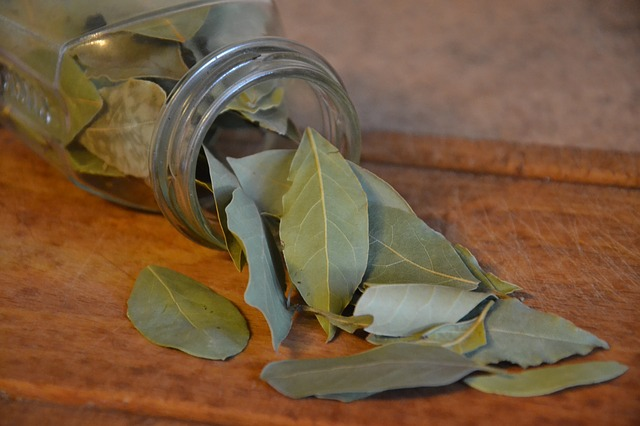
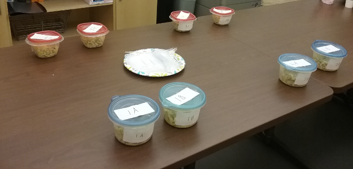

```{r setup, include = FALSE}
library(dplyr)
library(tibble)
library(kableExtra)
library(ggplot2)
options(htmltools.dir.version = FALSE)
theme_update(axis.title.x = element_text(size = 20),
             axis.title.y = element_text(size = 20),
             axis.text = element_text(size = 15),
             strip.text = element_text(size = 12))
```

class: center, middle

## "My First Experiment"

---
class: center, middle

## "My First ~~Experiment~~ Stan Model"

---
class: center, middle



---
class: center, middle



---
class: center, middle

```{r plot_raw_data, echo = F, message = F, warning = F, fig.width = 6, fig.height = 6}
ggplot(obs.df, aes(x = prefer.bay.leaf)) +
  geom_bar() +
  scale_x_discrete("preferred bay leaf") +
  scale_y_continuous("number of observations")
```

---

## The model

$$\mbox{prefer.bay.leaf} = \mbox{Bernoulli}(\mbox{logit}^{-1}(\beta + \gamma_i\sigma_{\gamma} + \delta_j\sigma_{\delta}))$$

--

* $\beta$: overall intercept

--

* $\gamma_i$: intercept for batch $i$
* $\sigma_{\gamma}$: standard deviation of $\gamma_i$

--

* $\delta_j$: intercept for subject $j$
* $\sigma_{\delta}$: standard deviation of $\delta_j$

--

$$\beta \sim \mbox{N}(0, 2)$$

--

$$\gamma_i, \delta_j \sim \mbox{N}(0, 1)$$

--

$$\sigma_{\gamma}, \sigma_{\delta} \in [0,\inf] \sim \mbox{Cauchy}(0, 1)$$

---

## What Stan gives you

.center[
```{r stan_results, echo = F, message = F, warning = F}
sampled.params.df %>%
  mutate(sample = draw.id,
         "..." = "...") %>%
  dplyr::select(sample, beta, gamma.1., gamma.2., gamma.3., gamma.4.,
                sigma_gamma, delta.1., delta.2., "...") %>%
  head(15) %>%
  kable(format = "html") %>%
  kable_styling(font_size = 12)
```
]

(Plus various summary statistics, diagnostics, etc.)

---

## Exploring a single parameter

.center[
```{r plot_beta, echo = F, message = F, warning = F, fig.width = 8, fig.height = 6}
sampled.params.long.df %>%
  filter(parameter == "beta") %>%
  ggplot(aes(x = sampled.value)) +
  geom_histogram() +
  geom_vline(xintercept = 0, col = "red") +
  scale_x_continuous(expression(beta)) +
  scale_y_continuous("number of samples")
```
]

---

## Exploring a single parameter

.center[
```{r plot_beta_transformed, echo = F, message = F, warning = F, fig.width = 8, fig.height = 6}
sampled.params.long.df %>%
  filter(parameter == "beta") %>%
  mutate(prob.prefer.bay.leaf = invlogit(sampled.value)) %>%
  ggplot(aes(x = prob.prefer.bay.leaf)) +
  geom_histogram() +
  geom_vline(xintercept = 0.5, col = "red") +
  scale_x_continuous(expression(paste("probability of preferring bay leaf: ",
                                      logit^-1,
                                      (beta),
                                      sep = ""))) +
  scale_y_continuous("number of samples")
```
]

---

## Exploring multiple parameters together

.center[
```{r batch_parameters_gamma, echo = F, message = F, warning = F}
sampled.params.df %>%
  mutate(sample = draw.id,
         "..." = "...") %>%
  dplyr::select(sample, beta, gamma.1., gamma.2., gamma.3., gamma.4.,
                sigma_gamma) %>%
  head(15) %>%
  kable(format = "html") %>%
  kable_styling(font_size = 12) %>%
  column_spec(3, background = "#90EE90")
```
]

---

## Exploring multiple parameters together

.center[
```{r batch_parameters_all, echo = F, message = F, warning = F}
sampled.params.df %>%
  mutate(sample = draw.id) %>%
  dplyr::select(sample, beta, gamma.1., gamma.2., gamma.3., gamma.4.,
                sigma_gamma) %>%
  head(15) %>%
  kable(format = "html") %>%
  kable_styling(font_size = 12) %>%
  column_spec(3, background = "#90EE90") %>%
  column_spec(c(2, 7), background = "#CCEECC")
```
]

probability of preferring bay leaf in batch 1: $\mbox{logit}^{-1}(\beta + \gamma_1\sigma_{\gamma})$

---

## Exploring multiple parameters together

.center[
```{r plot_gamma_correlations, echo = F, message = F, warning = F, fig.width = 10, fig.height = 5}
sampled.params.df %>%
  dplyr::select(draw.id, beta, gamma.1., gamma.2., gamma.3., gamma.4.,
                sigma_gamma) %>%
  gather(batch.id, gamma, -draw.id, -beta, -sigma_gamma) %>%
  mutate(batch.id = gsub("^gamma\\.([0-9]+)\\.", "\\1", batch.id)) %>%
  gather(other.param, value, -draw.id, -batch.id, -gamma) %>%
  ggplot(aes(x = gamma, y = value)) +
  geom_point(alpha = 0.05) +
  facet_grid(other.param ~ batch.id, scales = "free_y") +
  scale_y_continuous("other parameter value")
```
]

---

## Exploring multiple parameters together

.center[
```{r batch_parameters_computed, echo = F, message = F, warning = F}
sampled.params.df %>%
  mutate(sample = draw.id,
         batch.1.prob = invlogit(beta + (gamma.1. * sigma_gamma))) %>%
  dplyr::select(sample, beta, gamma.1., gamma.2., gamma.3., gamma.4.,
                sigma_gamma, batch.1.prob) %>%
  head(15) %>%
  kable(format = "html") %>%
  kable_styling(font_size = 12) %>%
  column_spec(c(2, 3, 7), background = "#CCEECC") %>%
  column_spec(8, background = "#90EE90")
```
]

probability of preferring bay leaf in batch 1: $\mbox{logit}^{-1}(\beta + \gamma_1\sigma_{\gamma})$

---

## Exploring multiple parameters together

.center[
```{r plot_batch_intercepts, echo = F, message = F, warning = F, fig.width = 10, fig.height = 7}
sampled.group.params.df %>%
  filter(parameter.group == "gamma") %>%
  inner_join(sampled.params.long.df %>%
               filter(parameter == "beta") %>%
               dplyr::select(draw.id, sampled.value),
             by = c("draw.id")) %>%
  mutate(est.prob = invlogit(sampled.value.x + sampled.value.y)) %>%
  group_by(parameter.num) %>%
  summarize(mean.prob.bay.leaf = mean(est.prob),
            upper.95 = quantile(est.prob, 0.975),
            upper.50 = quantile(est.prob, 0.75),
            lower.50 = quantile(est.prob, 0.25),
            lower.95 = quantile(est.prob, 0.025)) %>%
  ggplot(aes(x = factor(parameter.num), y = mean.prob.bay.leaf)) +
  geom_hline(yintercept = 0.5, col = "red") +
  geom_point(size = 4) +
  geom_errorbar(aes(ymin = lower.95, ymax = upper.95),
                width = 0) +
  geom_errorbar(aes(ymin = lower.50, ymax = upper.50),
                width = 0, size = 2) +
  scale_x_discrete("batch ID") +
  scale_y_continuous(expression(paste("probability of preferring bay leaf: ",
                                      logit^-1,
                                      (beta + gamma[i] * sigma[gamma[i]]),
                                      "; mean, 50%, 95%",
                                      sep = ""))) +
  coord_flip()
```
]

---
class: middle

# Working with samples transforms a problem of integral calculus into a problem of data summary.

Richard McElreath, _Statistical Rethinking: A Bayesian Course with Examples in R and Stan_, p. 68

---
class: middle

GitHub repository:

https://github.com/kaplanas/Bay-Leaf-Experiment

GitPages write-up:

https://kaplanas.github.io/Bay-Leaf-Experiment/bay_leaf_analysis.html

this presentation:

https://kaplanas.github.io/Bay-Leaf-Experiment/rug_lightning_talk.html

